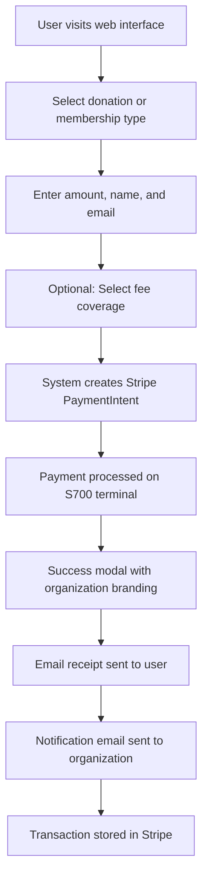

# 🏪 Community POS System - Project Context

## 📋 Overview

This is a **Flask-based point-of-sale system** for community organizations that enables in-person payment processing for donations and memberships using Stripe Terminal hardware. 

### Key Features:
- ✅ Optional fee coverage allowing users to cover Stripe processing fees (2.9% + $0.30)
- ✅ Transparent cost breakdown
- ✅ Professional success modal with organization branding
- ✅ Automatic email receipt system

## 🛠️ Technology Stack

| Component | Technology |
|-----------|-----------|
| **Backend** | Python Flask web application |
| **Payment Processing** | Stripe Terminal API (v8.11.0) with S700 card reader |
| **Email** | OAuth2-authenticated Gmail API for receipts and notifications |
| **Deployment** | Docker containers with Caddy reverse proxy for SSL |
| **Frontend** | Bootstrap-based web interface with JavaScript |
| **Fee Calculation** | Real-time Stripe fee calculations with optional coverage |
| **SSL** | Automatic HTTPS with Let's Encrypt via Caddy |

## Key Files
- `app/main.py` - Main Flask application with payment processing logic
- `templates/index.html` - Web interface for payment collection
- `templates/donor_acknowledgment_email.html` - Professional HTML email template for donation receipts
- `templates/donor_acknowledgment_email_template.html` - Generic template for other organizations
- `donor-ack.txt` - Source text for donation acknowledgment emails
- `docker-compose.yml` - Development container orchestration
- `docker-compose.prod.yml` - Production setup with Caddy SSL proxy
- `Caddyfile` - Caddy configuration for SSL and reverse proxy
- `requirements.txt` - Python dependencies
- `generate_oauth_token.py` - OAuth2 setup utility

## Environment Configuration
The application requires these environment variables:
- `STRIPE_SECRET_KEY` - Stripe API key
- `STRIPE_LOCATION_ID` - Terminal location ID  
- `INDIVIDUAL_MEMBERSHIP_AMOUNT` - Individual membership price (cents, default: 3500)
- `HOUSEHOLD_MEMBERSHIP_AMOUNT` - Household membership price (cents, default: 5000)
- `ORGANIZATION_NAME/LOGO/WEBSITE` - Branding configuration
- `DOMAIN_NAME` - Primary domain (pos.yourdomain.org)
- `NOTIFICATION_EMAIL` - Organization notification recipient
- `GOOGLE_CLIENT_ID/SECRET/REFRESH_TOKEN` - OAuth2 credentials
- `FROM_EMAIL` - Sender email address

## 🚀 Development Commands

```bash
# Start development
docker compose up -d

# Start production
docker compose -f docker-compose.prod.yml up -d

# View logs
docker compose logs -f

# Stop containers
docker compose down

# Health check
curl http://localhost:8080/health
```

## Production Deployment
- Domain: Configure with your organization's domain (standard ports 80/443)
- Production runs with Caddy reverse proxy handling SSL
- Caddy handles SSL certificates automatically via Let's Encrypt
- Application enforces HTTPS redirects and domain consistency
- Reader status display automatically loads and shows connected devices

## 💳 Payment Flow



### Step-by-Step Process:
1. 🖥️ User selects donation or membership (individual/household) on web interface
2. ✍️ User enters amount (for donations), name, and **required** email address
3. 💰 User optionally selects fee coverage (shows transparent breakdown)
4. 🔄 System creates Stripe PaymentIntent with calculated amount
5. 💳 Payment processed on S700 terminal hardware
6. ✅ Success shows professional modal with organization logo and payment details
7. 📧 Automatic HTML email receipt sent to user with embedded letterhead
8. 📬 Organization notification email sent for tracking purposes
9. 💾 All transaction data stored in Stripe, no local database

## API Endpoints
- `GET /` - Main payment interface with automatic reader discovery
- `GET /admin-readers` - Admin interface for reader management
- `GET /health` - Health check endpoint
- `POST /calculate-fees` - Calculate processing fees for given amount/type
- `POST /create-payment-intent` - Create Stripe PaymentIntent with optional fees
- `POST /register-reader` - Register new Stripe terminal (development helper)
- `POST /discover-readers` - Find available Stripe terminals
- `POST /process-payment` - Process payment on selected terminal
- `GET /payment-status/<id>` - Check PaymentIntent status and send emails via Gmail API

## Fee Coverage Feature
- Calculates Stripe fees: 2.9% + $0.30 per transaction
- Optional checkbox with real-time fee display
- Transparent breakdown: base amount + processing fee = total
- Payment metadata tracks fee information for reporting
- Works for both donations and memberships

## User Interface Features
- **Professional Success Modal**: Displays organization logo, animated checkmark, and payment details
- **Required Email Validation**: HTML5 and JavaScript validation ensures email collection for receipts
- **Automatic Reader Discovery**: Main page automatically loads and displays connected S700 reader status
- **Responsive Design**: Bootstrap-based interface works on desktop and mobile devices
- **Real-time Fee Calculation**: Updates total amount as user toggles fee coverage option
- **Clear Visual Feedback**: Loading spinners, status messages, and error handling

## Hardware Setup
- **Card Reader**: Stripe S700 Terminal (configure with your reader)
- **Reader ID**: Configure with your terminal reader ID
- **Status**: Check terminal status in Stripe dashboard
- **Serial**: Your terminal's serial number

## Local Configuration
- Organization-specific files are stored in `local-config/` directory
- This directory is gitignored to prevent committing sensitive organization data
- Application automatically prefers local-config files when available
- See `local-config/README.md` for setup instructions

## Security Notes
- Environment files (.env*) are gitignored
- Uses OAuth2 for secure Gmail authentication
- Stripe handles all sensitive payment data
- Automatic HTTPS with security headers via Caddy
- Domain enforcement and HTTPS redirect
- Organization-specific data kept in local-config directory

## Email Receipt System
- **Professional HTML Templates**: Uses HTML email template with organization letterhead (configurable)
- **Embedded Images**: Organization letterhead image embedded as inline attachment for consistent display
- **Template Variables**: Dynamic content including donor name, amount, date, and transaction details
- **Tax Receipt Information**: Includes 501(c)(3) status, Tax ID, and IRS-compliant receipt language
- **Fallback Support**: Graceful fallback to simple HTML email if template loading fails
- **Gmail API Integration**: Secure OAuth2-authenticated sending via Gmail API
- **Local-Config Support**: Automatically uses organization-specific templates from local-config when available